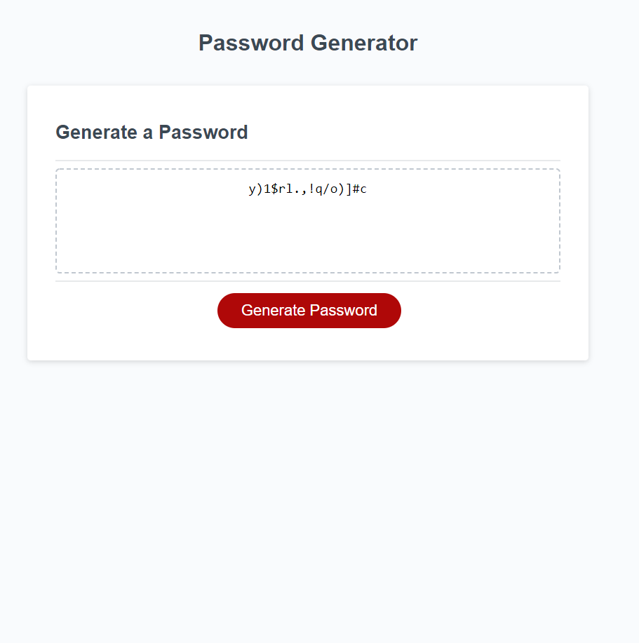

# The World's Best Password Generator 

## Description

This is the World's Best (claim not verified) Password generator. 🔐

- What is it?
This is a basic password generator that works programmed in javascript that creates a password based on preset, but user selectable, criteria and can produce passwords between 8 and 128 characters in length.

- How does it work?
This password generator works by concatenating approved string characters to one main string, from which random characters are selected

- What does it solve?
Say goodby to Qwerty, Password and 123456 and hello to the easy to remember
>y)1$rl.,!q/o)]#c 

easy to remember through a mnemonic (wh**y** (oh why **)**  is it your **1** true love is **$r**ich and **l**ovely **.** Well **,** hark **!** **q**uestioning **/** **or** thinking about such [sad **]** problems is the way to make you **#S**ad.

- Problems encountered?
While working on this I had to get comfortable with some basic javascript and working with randomizing loops. I opted to use a string and charAt instead of an array with bracket notation because it seemed like more work to type out commas between every index and strings somewhat behave like arrays in the way you can target their indices. 

## Deployed Site

[Live Site Viewable Here](https://hburnton.github.io/WorldsBestPasswordGenerator/)

## Credits
Starter code was provided by class which provided CSS, HTML, and basic javascript to allow button click. The rest came straight from the top of the dome

